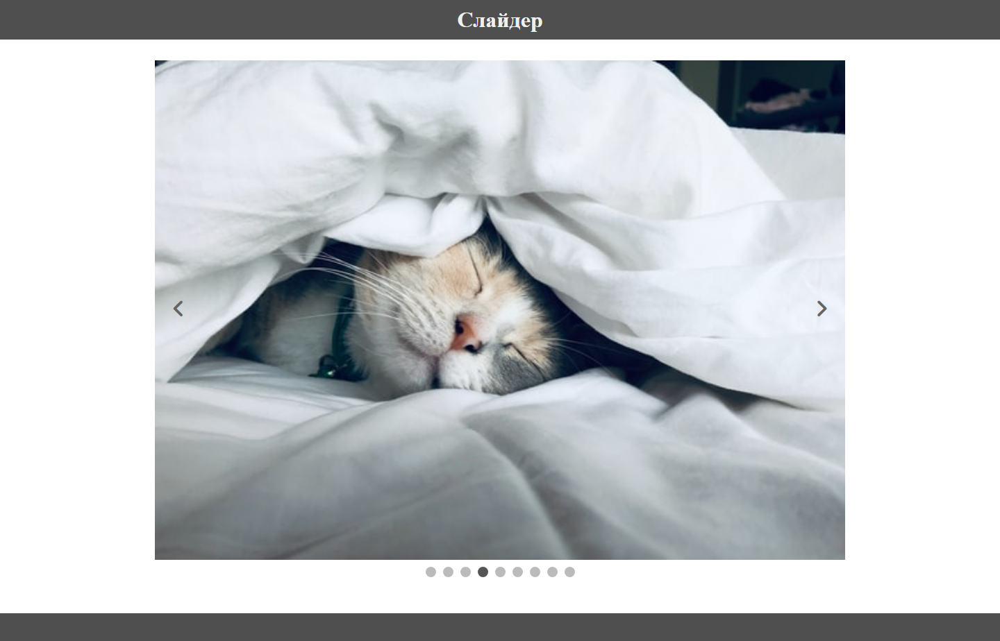

# [Интерактивный Слайдер Изображений](https:// "Ссылка на сайт")

## Описание проекта

Этот проект представляет собой интерактивный слайдер изображений, разработанный для веб-сайтов, который позволяет пользователям просматривать коллекцию изображений, используя интуитивно понятные кнопки навигации и точки-индикаторы. Слайдер поддерживает бесконечную прокрутку в обоих направлениях и автоматически адаптируется к размеру контента. Реализация на чистом JavaScript.

   Технологии:          

## Скриншоты сайта

Здесь представлен скриншот слайдера:

1. Скриншот десктопной версии
 

